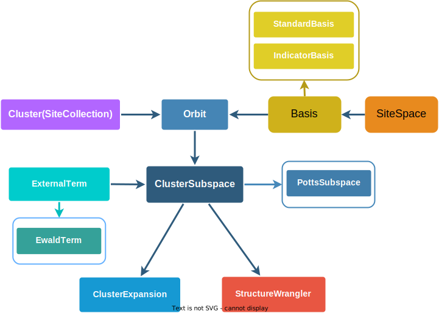
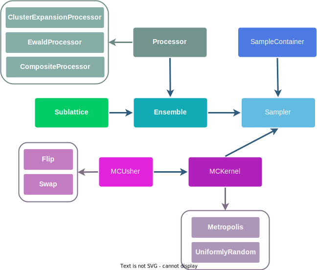

.. _design :

==============
Package Design
==============

Overview & mission
==================

**smol** is intentionally designed to be easy to use, install and extend. In order to
achieve these goals the package has few dependencies [#f1]_, and has a heavily
object-oriented and modular design that closely follows mathematical and methodological
abstractions. This enables flexible creation of complex workflows and hassle-free
implementation methodology extensions, that will rarely need to be implemented from
scratch.

Inheritance, polymorphism and composition are key OOP design concepts in **smol** that
result in a modular design, This *hopefully* allows to design complex calculation
workflows and implement new functionality without having to implement new classes and
functions from scratch.

**smol** has been designed to enable efficient and open development of new methodology
for fitting and sampling applied lattice models in a user-friendly way; and as a result
allow quick development-to-application turnaround time in the study of configuration
dependent properties of inorganic materials.

Module Design
=============

Below is a detailed description of the classes and their relationships in the main
modules. Before delving into these we recommend going over the simpler overview of the
package in the :ref:`user_guide` page.

Diagrams showing the main objects and their relationships for the :mod:`smol.cofe` and
:mod:`smol.moca` are presented below. In these diagrams base classes are depicted in
filled (and unboxed) rectangles, derived classes are depited in boxed rectangles with
an colored arrow pointing from the base class to the derived classes.

Ownership relationships between distinct classes (i.e. when a class has another class
as an attribute) are depicted as dark blue colored arrows. The arrow points from the
class which is an attribute to the class that holds the former as an attributed.

smol.cofe
---------

smol.moca
---------

.. rubric:: Footnotes

.. [#f1] The dependence on **pymatgen** implicitly includes all of its dependecies---
         which are many. However, once **pymatgen** is properly installed, then
         installing **smol** should be headache free.
