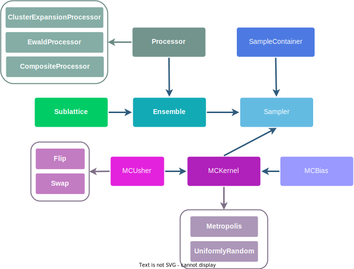

.. _design :

==============
Package Design
==============

Overview & Mission
==================

**smol** is intentionally designed to be easy to use, install and extend. In order to
achieve these goals the package has few dependencies [#f1]_, and has a heavily
object-oriented and modular design that closely follows mathematical and methodological
abstractions. This enables flexible creation of complex workflows and hassle-free
implementation methodology extensions, that will rarely need to be implemented from
scratch.

Inheritance, polymorphism and composition are key OOP design concepts in **smol** that
result in a modular design, This *hopefully* allows to design complex calculation
workflows and implement new functionality without having to implement new classes and
functions from scratch.

**smol** has been designed to enable efficient and open development of new methodology
for fitting and sampling applied lattice models in a user-friendly way; and as a result
allow quick development-to-application turnaround time in the study of configuration
dependent properties of inorganic materials.

Module Design
=============

**smol** is organized into two main submodules, :mod:`smol.cofe` and
:mod:`smol.moca`:

- :mod:`smol.cofe` implements the classes and functions to represent
  site spaces, configuration spaces and function subspaces over them, and the tools
  necessary to fit lattice models, in the spirit of *cluster expansions* and the
  *structure inversion method*.
- :mod:`smol.moca` has implementations of classes to carry out Monte Carlo sampling of
  ensembles associated with a fitted lattice model Hamiltonian, as well as simple
  empirical models such as a point Coulomb potential.

Below is a detailed description of the classes and their relationships in the main
modules. Before delving into these we recommend going over the simpler overview of the
package in the :ref:`user_guide` page.

Diagrams showing the main objects and their relationships for the :mod:`smol.cofe` and
:mod:`smol.moca` are presented below. In these diagrams base classes are depicted in
filled (and unboxed) rectangles, derived classes are depited in boxed rectangles with
an colored arrow pointing from the base class to the derived classes.

Ownership relationships between distinct classes (i.e. when a class has another class
as an attribute) are depicted as dark blue colored arrows. The arrow points from the
class which is an attribute to the class that holds the former as an attributed.

:mod:`smol.cofe`
----------------

The diagram below summarizes the overall design of the :mod:`smol.cofe` module. The main
classes that users directly instantiate and interact with are the
:class:`ClusterSubspace`, :class:`StructureWrangler`, and :class:`ClusterExpansion` as
detailed in the :ref:`user_guide`. All main classes are derived from :mod:`monty`
:class:`MSONable` and thus can be serialized and saved as JSON objects.
In addition, several other classes are defined to enable the various features and
functionality in the module.

.. image:: ../_static/smol_cofe.svg
    :class: dark-light p-2

Following the diagram above, the main purpose of the classes depicted is,

* :class:`ClusterSubspace` (and its derived class :class:`PottsSubspace`) is the main
  work horse to construct and represent configuration spaces and the function spaces
  over them. Its main purpose is to compute *correlation function* values given an
  ordered structure. In order to do so, it holds a list of :class:`Orbit` objects
  generated for a particular disordered :mod:`pymatgen` :class:`Structure`. Additionally
  an *external term* representing a simple empricial potential model can also be
  included. Currently only an :class:`EwaldTerm`, to represent a point electrostatic
  potential is available.

  * An :class:`Orbit` represents both the set of symmetrically equivalent clusters, as
    well as the set of *product functions* that act over the configurations of those
    clusters. An orbit holds a base :class:`Cluster` and a list of :ref:`SiteBasis`
    associated with each site in the cluster.

    * A :class:`Cluster` is a collection of sites (derived from :class:`SiteCollection`
      in :mod:`pymatgen`). The two key concepts of a :class:`Cluster` is that compared
      to a :class:`Structure` they do hold periodic sites, and compared to a
      :class:`Molecule` the hold a lattice (of the structure they are associated with).
    * A :class:`SiteBasis` represents the basis set that spans the function space of
      the configurations for a single site. Several types of basis sets are included
      and implementing new ones is relatively straightforward. A :class:`SiteBasis` holds
      a :class:`SiteSpace` which represents its single site configuration space.

      * :class:`SiteSpace` represents the possible configurations of a given site.
        It essentially holds a :mod:`pymatgen` :class:`Composition`, with the addition
        of an explicit :class:`Vacancy` species, for compositions that do not sum to 1.

  * An external term, representing a simple empirical pair potential can also be
    included in a :class:`ClusterSubspace` to create a mixture model (i.e. a Cluster
    expansion + an empirical potential). Currently an :class:`EwaldTerm` is implemented
    to allow mixture models of cluster expansions with explicit electrostatics.

* A :class:`StructureWrangler` is the main object for training data preparation.
  Training data is held as a list of :mod:`pymatgen` :class:`ComputedStructureEntry`. The
  :class:`StructureWrangler` holds a given :class:`ClusterSubspace`, and takes care of
  making sure training structures can be correctly mapped to the disordered unit
  structure of the :class:`ClusterSubspace`. The corresponding correlation vectors of
  the training structures that can be correctly mapped are computed to form the
  correlation matrix (feature matrix) necessary for training. In addition, the
  :class:`StructureWrangler` has several methods that allow to inspect and further
  prepare training data, such as checking for duplicates, obtaining correlation matrix
  properties, and most importantly obtaining a properly normalized property vector for
  training (the normalization is done per the disordered unit cell from the
  :class:`ClusterSubspace` ).

* A :class:`ClusterExpansion` represent the final *fitted* lattice model. It holds
  a :class:`ClusterSubspace`, and a corresponding set of fitted coefficients. A
  :class:`ClusterSubspace` can be used to predict the energy of new structures, as well
  as obtain the *effective cluster interactions* (ECI), and prune unimportant terms.

:mod:`smol.moca`
----------------

A diagram showing the overall design of the :mod:`smol.moca` module. The
main classes in this module that are necessary to run Monte Carlo sampling using
a :class:`ClusterExpansion` are the :class:`Processor` classes, the :class:`Ensemble`,
and the :class:`Sampler` class. However, a number of helper classes are implemented
to allow running and implementing a large variety of types of MC calculations.

The class descriptions are as follows,

* An :class:`Ensemble` represents the probability space associated with a particular
  lattice model and thermodynamic boundary conditions (i.e. :attr:`chemical_potentials`)
  over a finite simulation domain size, which is represented by a supercell matrix of
  an associated unit cell. An :class:`Ensemble` holds a :class:`Processor` and a list
  of :class:`Sublattice` instances.

  * :class:`Sublattice` represents the set of sites of the defined supercell that are
    have the same site space (set of allowed species). :class:`Sublattice` instances
    can also be split according to a particular *frozen* configuration.
  * :class:`Processor` instances, hold a :class:`ClusterSubspace` and represent a
    particular sampling domain in the form of a supercell matrix (of the corresponding
    disordered unit cell). A :class:`Processor` allows to quickly and efficiently
    calculate the fitted property and differences from local updates for a given
    configuration (over the represented supercell). A :class:`Processor` can also
    generate occupancy strings given an ordered supercell structure, as well as
    generate the :class:`Sublattice` instances for the different sites in the
    supercell domain.

* A :class:`Sampler` is the main class to run MC sampling given a particular
  :class:`Ensemble` instance. Apart from the ensemble to be sampled, a :class:`Sampler`
  holds the an :class:`MCKernel` that implements the particular sampling algorithm, and
  a :class:`SampleContainer` to record the sampled configurations, correlation vectors,
  enthalpy, and any other associated state variable.

  * :class:`MCKernel` are implementations of particular MC algorithms, such as the
    :class:`Metropolis` kernel. They take care of generating the Markov chain, sampling
    histograms, and any other configuration and state attribute. The include an
    :class:`MCUsher` to propose steps, and may also include an optional :class:`MCBias`
    to bias samples to particular configurations in phase space.

    * An :class:`MCUsher` has the purpose of proposing the steps to carry out the
      random walk for an MC calculation. The simplest are a :class:`Flip` for single
      site species changes, and a :class:`Swap` for swapping the species at two sites.
      However implementing new :class:`MCUsher` for more complex random walks should
      be relatively straightforward.
    * An :class:`MCBias` serves as an additional term that can be included to bias
      acceptance probabilities in order to carry out sampling from *extended* or
      *biased* ensembles.

  * MC samples are saved in a :class:`SamplerContainer` from sampled :class:`Trace`
    objects. These will always include the configurations, correlations or features,
    and the energy or enthalpy. Additional values depending on the particular
    :class:`MCKernel` used are also saved. A :class:`SampleContainer` has functionality
    to obtain simple mean and variances of sampled values. In addition, a
    :class:`SampleContainer` can be saved as either a json file or an hdf5 container.
    During lengthy simulations, samples can be streamed into an hdf5 container to
    minimize memory requirements; further, using hdf5 containers in
    `single writer multiple reader <https://docs.h5py.org/en/stable/swmr.html>`_ mode
    allows users to begin looking at samples before a simulation has concluded.

.. rubric:: Footnotes

.. [#f1] The dependence on **pymatgen** implicitly includes all of its dependecies---
         which are many. However, once **pymatgen** is properly installed, then
         installing **smol** should be headache free.
