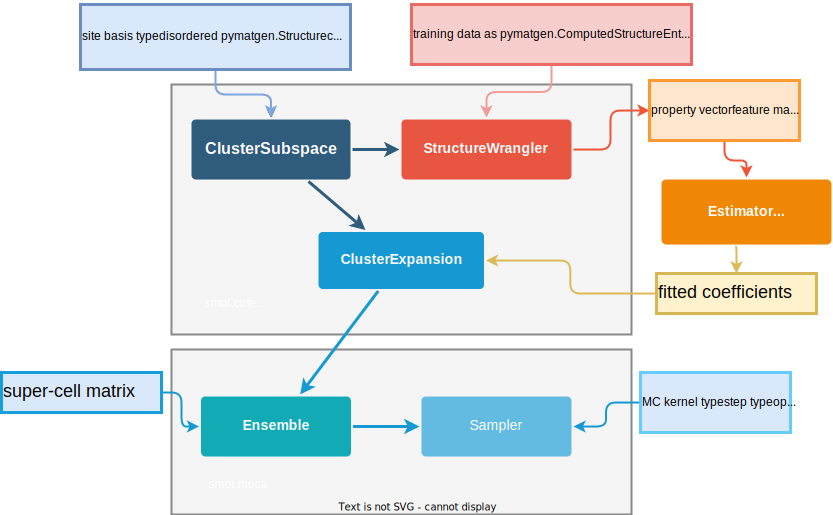

.. _user_guide :

==========
User Guide
==========

**smol** implements functionality and extensions of CE-MC methodology. It includes tools
to define, generate and fit a cluster expansion (or more generally an applied lattice
model). Additionally, it includes tools to run Monte Carlo simulations to sample
thermodynamic properties based on a fitted lattice model. The package is organized in
two main submodules:

- :ref:`smol.cofe ug` (:mod:`smol.cofe`) includes classes and
  functions to define, train, and test cluster expansions.
- :ref:`smol.moca ug` (:mod:`smol.moca`) includes classes and functions to run
  Markov Chain Monte Carlo (MCMC) sampling based on a cluster expansion
  Hamiltonian (and a few other Hamiltonian models).

Overview diagram
================

An overview diagram of the main classes and data inputs necessary to build and sample
a lattice model is shown below.

Following the diagram above, the general workflow to construct, fit and sample a lattice
model is as follows,

#. Create a :class:`ClusterSubspace` based on a disordered primitive :mod:`pymatgen`
   `Structure <https://pymatgen.org/pymatgen.core.structure.html>`_, a given set of
   diameter cutoffs for clusters, and a specified type of basis set.
#. Use the :class:`ClusterSubspace` to create a :class:`StructureWrangler` to generate
   fitting data in the form of correlation vectors and a normalized property (usually
   energy). The training data, energy and additional properties are added to the
   :class:`StructureWrangler` as :mod:`pymatgen` entries of type
   `ComputedStructureEntry <https://pymatgen.org/pymatgen.entries.computed_entries.html?highlight=computedstructureentry#pymatgen.entries.computed_entries.ComputedStructureEntry>`_.
#. Fitting data in the form of a correlation :attr:`StructureWrangler.feature_matrix`
   and a normalized property :meth:`StructureWrangler.get_property_vector` can be used
   as input to a linear regression estimator from any choice of third party package,
   such as :mod:`scikit-learn`, :mod:`glmnet` or :mod:`sparse-lm`.
#. Using the fitted coefficients and the :class:`ClusterSubspace` instance, a
   :class:`ClusterExpansion` is constructed. A :class:`ClusterExpansion` can be used
   to predict properties of new structures, obtain the *effective cluster interactions*,
   prune out unimportant terms, among other things.
#. Using a :class:`ClusterExpansion` instance, an :class:`Ensemble` object can be
   created to sample the corresponding Hamiltonian for a given supercell size and shape
   that is specified as a supercell matrix of the unit cell corresponding to the
   disordered structure used in the first step.
#. Finally, an :class:`Ensemble` can be sampled in a Monte Carlo simulation by using a
   an :class:`Sampler`.

This simple workflow shown is sufficient for the majority of applications. A summary of
the main classes is given below. For more advanced use and custom calculations a more
detailed description of the package is given in the
:ref:`design` section of the Developing page.

----------------------------------------------------------------------------------------

Main classes
============

Below is a general description of the core classes in each submodule, to help understand
the design, usage and capabilities of **smol**. You can also refer to the :ref:`api ref`
for full documentation of all classes and functions in the package.

.. _smol.cofe ug:

Cluster Orbit Function Expansions
---------------------------------

:mod:`smol.cofe` includes the necessary classes to define, train, and test cluster
expansions. A cluster expansion is essentially a way to fit a function of
configurational degrees of freedom using a specific set of basis functions that
allow a sparse representation of that function (which resides in a high
dimensional function space). For a more thorough treatment of the formalism of
cluster expansions refer to this document or any of following references
[`Sanchez et al., 1993 <https://doi.org/10.1103/PhysRevB.48.14013>`_,
`Ceder et al., 1995 <https://doi.org/10.1103/PhysRevB.51.11257>`_,
`van de Walle et al., 2009 <https://doi.org/10.1016/j.calphad.2008.12.005>`_].

The core classes are:

- :ref:`cluster subspace ug`
- :ref:`structure wrangler ug`
- :ref:`cluster expansion ug`

.. _cluster subspace ug:

Cluster subspace
^^^^^^^^^^^^^^^^
:class:`ClusterSubspace` contains the finite set of orbits and orbit basis
functions to be included in the cluster expansion.
In general, a cluster expansion is created by first generating a
:class:`ClusterSubspace`, which uses a provided primitive cell of the
:mod:`pymatgen` `Structure <https://pymatgen.org/pymatgen.core.structure.html>`_
class to build the orbits of the cluster expansion. Because orbits generally
decrease in importance with length, it is recommended to use the convenience
method :meth:`from_cutoffs` to specify the cutoffs of different size
orbits (pairs, triplets, quadruplets, etc.) In addition to specifying the
type of site basis functions and their orthonormality,
:class:`ClusterSubspace` also has capabilities for matching fitting structures
and determining site mappings to compute correlation vectors. A variety of options
for commonly used site basis sets are readily available, including:

* Polynomial [`Sanchez et al., 1993 <https://doi.org/10.1103/PhysRevB.48.14013>`_]
* Sinusoid [`van de Walle et al., 2009 <https://doi.org/10.1016/j.calphad.2008.12.005>`_]
* Species indicator (aka lattice gas) [`Zhang et al. 2015 <https://doi.org/10.1007/s11669-015-0427-x>`_]

Additionally, the subclass :class:`PottsSubspace` implements the terms to build a
redundant (frame) expansion using site indicator functions
[`Barroso-Luque et al., 2021 <https://doi.org/10.1103/PhysRevB.104.224203>`_]

Full documentation of the class is available here, :ref:`cluster space`.

.. _structure wrangler ug:

Structure wrangler
^^^^^^^^^^^^^^^^^^
:class:`StructureWrangler` handles input data structures and properties
to fit to the cluster expansion.
Once a set of structures and their relevant properties (for example, their
volume or energies) have been obtained (e.g., through first-principles
calculations), :class:`StructureWrangler` can be used to process this data.
Specifically, based on a given :class:`ClusterSubspace`,
:class:`StructureWrangler` can to compute correlation vectors and convert
the input structure data into a feature matrix for fitting to the property
vector. Additional methods are available to help process the input data,
including methods for checking, preparing, and filtering the data.

Full documentation of the class is available here: :ref:`structure wrangler`.

.. _cluster expansion ug:

Cluster expansion
^^^^^^^^^^^^^^^^^
:class:`ClusterExpansion` contains the fitted coefficients of the cluster
expansion for predicting CE properties of new structures.
Based on the feature matrix from the :class:`StructureWrangler`, one can fit
fit the data to the properties using any fitting method they like (e.g.,
linear regression, regularized regression, etc). :code:`smol.cofe`
contains wrapper class :class:`RegressionData` to save important information from
the regression method used (optionally including the feature matrix, target vector,
regression class, and hyperparameters). Specifically a convenience constructor to
extract information from regression methods in
`sklearn <https://scikit-learn.org/stable/>`_ or those following their API is included.
The fitted coefficients and

:class:`ClusterSubspace` objects are then given to :class:`ClusterExpansion`.
The :class:`ClusterExpansion` object can be used to predict the properties
of new structures but more importantly can be used along with the :ref:`smol.moca ug`
classes for MC sampling.

Full documentation of the class is available here: :ref:`cluster expansion`.

----------------------------------------------------------------------------------------

.. _smol.moca ug:

Monte Carlo
-----------

:mod:`smol.moca` includes classes and functions to run Markov Chain Monte Carlo
sampling of statistical mechanical ensembles represented by a cluster expansion
Hamiltonian (there is also support to run MCMC with simple pair interaction
models, such as Ewald electrostatic interactions). MCMC sampling is done for a
specific supercell size. In theory the larger the supercell the better the
results, but in practice there are many other nuances for picking the right
supercell size that are beyond the scope of this documentation. Our general
suggestion is to use the minimum supercell size that ensures convergence of
the property of interest at equilibrium. Note that for extensive properties,
the property of interest is usually the normalized property (e.g. energy per
prim).

The core classes are:

- :ref:`processors ug`

  - :class:`ClusterExpansionProcessor`
  - :class:`ClusterDecompositionProcessor`
  - :class:`EwaldProcessor`
  - :class:`CompositeProcessor`

- :ref:`ensemble ug`
- :ref:`sampler ug`
- :ref:`samplecontainer ug`

.. _processors ug:

Processors
^^^^^^^^^^
A :class:`Processor` is used to optimally compute correlation vectors, energy,
and differences in these from variations in site occupancies. Processors
compute values only for a specific supercell specified by a given supercell
matrix.

Users will rarely need to directly instantiate a processor, and it is recommended
to simply create an ensemble using the :meth:`from_cluster_expansion` which
will automatically instantiate the appropriate processor. Then, accessing the
processor can be done simply by the corresponding attribute (i.e.
:code:`ensemble.processor`). Many methods and attributes of a processor are
very useful for setting up and analysing MCMC sampling runs. For more advanced or
specific use cases, users will need to instantiate the appropriate processor directly.

Full documentation of the class and its subclasses available here: :ref:`processors`.

.. _ensemble ug:

Ensemble
^^^^^^^^
The :class:`Ensemble` class represents the specific statistical mechanics ensemble
by defining the relevant thermodynamic boundary conditions in order to compute
the appropriate ensemble probability ratios. For example,
canonical ensemble is used for systems at constant temperature and
constant composition, and can be created simply using an :class:`Ensemble` without setting
any chemical potentials. While a semigrand ensemble is used for systems at
constant temperature and constant chemical potential, which can be created simply by setting
the :class:`Ensemble` :prop:`chemical_potentials`. Ensembles also hold
information of the underlying set of :class:`Sublattice` for the configuration
space to be sampled. Note that as implemented, an ensemble applies to any
temperature, but the specific temperature to generate samples at is set in kernel used
when sampling using a :class:`Sampler`.

Full documentation of the class and its subclasses are available here: :ref:`ensemble`.

.. _sampler ug:

Sampler
^^^^^^^
A :class:`Sampler` takes care of running MCMC sampling for a given ensemble.
The easiest way to create a sampler (which suffices for most use cases) is to
use the :meth:`from_ensemble` class method, which is sufficient for most cases using
only a Metropolis algorithm and simple state transitions. For more advanced use cases
and elaborate MCMC sampling more knowledge of the underlying classes (especially
:class:`Metropolis` which applies the `Metropolis-Hastings algorithm
<https://doi.org/10.1093/biomet/57.1.97>`_ and
:class:`MCUsher` which proposes relevant flips) is necessary.

Full documentation of the class is available here: :ref:`sampler`.

.. _samplecontainer ug:

SampleContainer
^^^^^^^^^^^^^^^
A :class:`SampleContainer` stores data from Monte Carlo sampling simulations,
especially the occupancies and feature vectors. For lengthy MC simulations a
:class:`SampleContainer` allows streaming directly to an
`HDF5 <https://www.hdfgroup.org/solutions/hdf5/>`_ file, and so minimize
computer memory requirements. It also includes some minimal methods and properties
useful to begin analysing the raw samples, including methods to obtain the
mean/variance/minimum of energies, enthalpies, and composition.

Full documentation of the class is available here: :ref:`sample container`.
